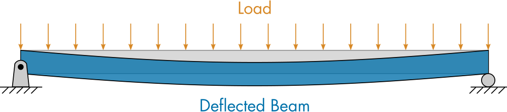
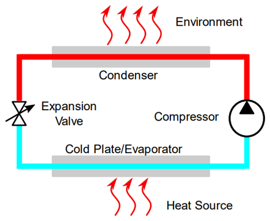

# Solid Mechanics: Beam Bending and Deflection

 or 

**Curriculum Module**

_Created with R2024b. Compatible with R2024b and later releases._

# Information

This curriculum module contains interactive [MATLAB® live scripts](https://www.mathworks.com/products/matlab/live-editor.html) that teaches the fundamental concepts of Solid Mechanics.

## Background

You can use these live scripts as demonstrations in lectures, class activities, or interactive assignments outside class. Mechanics of Materials covers topics such as beam bending and beam deflection and how to solve those problems analytically. In the first script, you'll learn how to solve for beam support reactions and moments. In the second script, you'll solve for beam deflections using symbolic integration and create plots of the results. 

The instructions inside the live scripts will guide you through the exercises and activities. Get started with each live script by running it one section at a time. To stop running the script or a section midway (for example, when an animation is in progress), use the  Stop button in the **RUN** section of the **Live Editor** tab in the MATLAB Toolstrip.

## Contact Us

Solutions are available upon instructor request. Contact the [MathWorks teaching resources team](mailto:onlineteaching@mathworks.com) if you would like to request solutions, provide feedback, or if you have a question.

## Prerequisites

This module assumes knowledge of basic solid mechanics theory and standard mechanical materials notation. There is some MATLAB knowledge required for these scripts, but you could use [MATLAB Onramp](https://matlabacademy.mathworks.com/details/matlab-onramp/gettingstarted) as a resource to acquire familiarity with MATLAB syntax and live scripts. Throughout the module, there are short activities that introduce you to the [Symbolic Math Toolbox*™*](https://www.mathworks.com/products/symbolic.html) capabilities.

## Getting Started
### Accessing the Module
### **On MATLAB Online:**

Use the  link to download the module. You will be prompted to log in or create a MathWorks account. The project will be loaded, and you will see an app with several navigation options to get you started.

### **On Desktop:**

Download or clone this repository. Open MATLAB, navigate to the folder containing these scripts and double\-click on [MechanicsOfMaterials.prj](https://github.com/MathWorks-Teaching-Resources/Mechanics-of-Materials/blob/release/MechanicsOfMaterials.prj). It will add the appropriate files to your MATLAB path and open an app that asks you where you would like to start. 

Ensure you have all the required products (listed below) installed. If you need to include a product, add it using the Add\-On Explorer. To install an add\-on, go to the **Home** tab and select   **Add-Ons** > **Get Add-Ons**. 

## Products

 *MATLAB* is used throughout. Tools from the Symbolic Math Toolbox are used frequently as well. Deep Learning Toolbox is used specifically for the [minmax](https://www.mathworks.com/help/deeplearning/ref/minmax.html) function.

# Scripts

 *If you are viewing this in a version of MATLAB prior to R2023b, you can view the learning outcomes for each script* [*here*](https://www.mathworks.com/matlabcentral/fileexchange/113670-mechanics-of-materials)

## [**BeamBending.mlx**](./Scripts/BeamBending.mlx)
|      |      |      |
| :-- | :-- | :-- |
|  | **In this script, students will...**    | **Academic disciplines**     |
|     | • Solve for beam support reactions symbolically.   • Solve for the moment function of a loaded beam.   • Plot shear and moment diagrams.   • Compute the bending stress in a loaded beam.    | • Mechanical Engineering   • Civil Engineering     |
|      |      |       |

## [**BeamDeflection.mlx**](./Scripts/BeamDeflection.mlx)
|      |      |      |
| :-- | :-- | :-- |
|  | **In this script, students will...**    | **Academic disciplines**     |
|     | • Solve boundary value problems using symbolic math.   • Identify boundary conditions for different types of beam supports.   • Solve for deflections of loaded beams.   • Visualize beam deflections.    | • Mechanical Engineering   • Civil Engineering     |
|      |      |       |

# License

The license for this module is available in the [LICENSE.md](https://github.com/MathWorks-Teaching-Resources/Mechanics-of-Materials/blob/release/LICENSE.md).

# Related Courseware Modules
## [Thermodynamics](https://www.mathworks.com/matlabcentral/fileexchange/126784-thermodynamics)
|      |      |
| :-- | :-- |
|     | **Available on:**           [GitHub](https://github.com/MathWorks-Teaching-Resources/Thermodynamics)      |
|      |       |

## [Fluid Mechanics](https://www.mathworks.com/matlabcentral/fileexchange/124840-fluid-mechanics)
|      |      |
| :-- | :-- |
|     | **Available on:**           [GitHub](https://github.com/MathWorks-Teaching-Resources/Fluid-Mechanics)     |
|      |       |

Feel free to explore our other [modular courseware content](https://www.mathworks.com/matlabcentral/fileexchange/?q=tag%3A%22courseware+module%22&sort=downloads_desc_30d).

# Educator Resources
-  [Educator Page](https://www.mathworks.com/academia/educators.html) 

# Contribute 

Looking for more? Find an issue? Have a suggestion? Please contact the [MathWorks teaching resources team](mailto:%20onlineteaching@mathworks.com). If you want to contribute directly to this project, you can find information about how to do so in the [CONTRIBUTING.md](https://github.com/MathWorks-Teaching-Resources/Mechanics-of-Materials/blob/release/CONTRIBUTING.md) page on GitHub.

 *©* Copyright 2023 The MathWorks™, Inc

